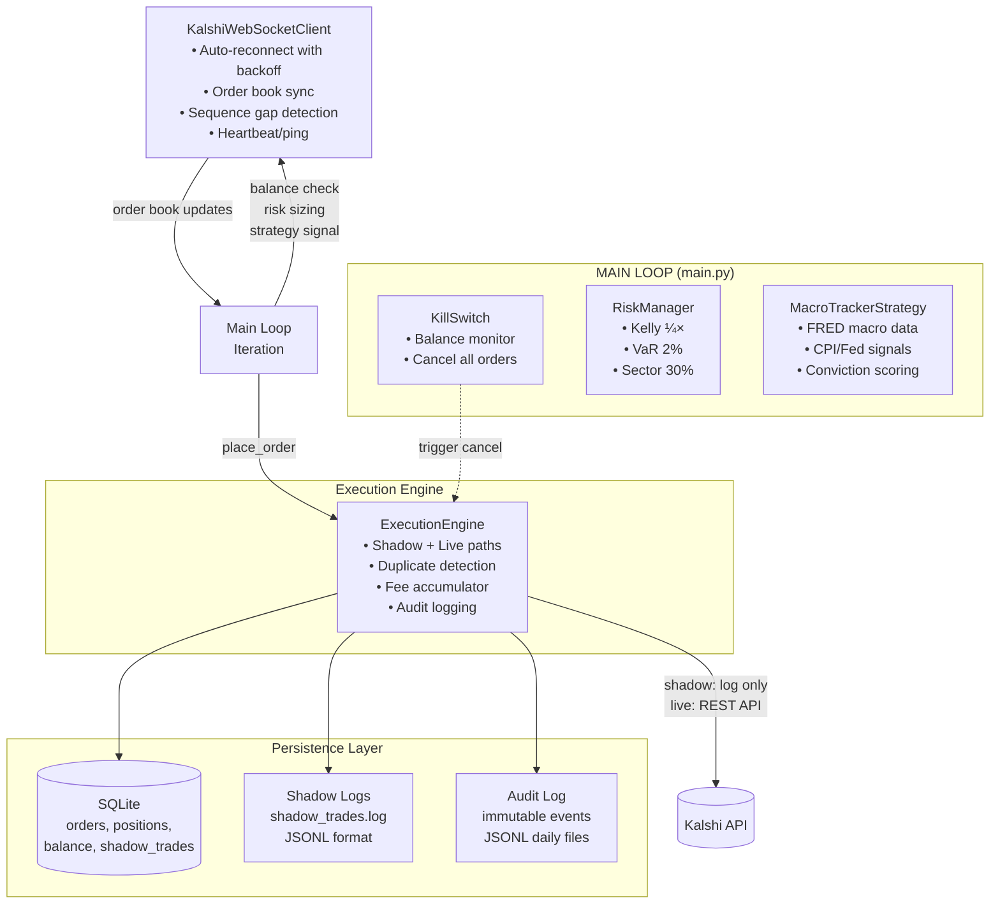

# Kalshi Trading Bot

[](https://python.org)
[](LICENSE)
[](https://github.com/astral-sh/ruff)
[](https://github.com/DavidEscotoDev/kalshi_bot/actions/workflows/ci.yml)
[](https://github.com/DavidEscotoDev/kalshi_bot/actions/workflows/ci.yml)

**TL;DR** — Production-grade autonomous trading bot for Kalshi prediction markets. Safety-first architecture: kill switches, circuit breakers, fractional Kelly sizing, shadow-mode validation. Built to demonstrate how autonomous systems handle real money without blowing up.

  <!-- TODO: Add architecture diagram screenshot -->

---

## Why This Project Matters

This isn't a toy trading bot. It's a **production safety case study** demonstrating how to build autonomous systems that handle real money:

| Safety Layer | Implementation | Fail Behavior |
|--------------|----------------|---------------|
| **Kill Switch** | Hard balance floor ($100 default) → auto-cancels ALL orders on breach | Fail-closed: API failure → assumes worst case → triggers anyway |
| **Circuit Breaker** | Retry with exponential backoff on 429/5xx; state machine (CLOSED→OPEN→HALF_OPEN) | Opens on repeated failures; manual/auto reset |
| **Position Sizing** | Kelly Criterion (¼×) + VaR cap (2%/trade) + Sector limit (30%) | Hard caps at every layer — math cannot exceed limits |
| **Shadow Mode** | Zero-risk validation: logs trades to SQLite + JSONL, never hits live API | Identical code path → validates strategy, sizing, risk before live |
| **Graceful Shutdown** | SIGINT/SIGTERM handlers → flush logs, close WS, vacuum DB | No orphaned orders, no partial state |
| **Audit Trail** | Every decision logged: orders, cancellations, risk checks, balance checks | Immutable JSONL + SQLite for replay/forensics |

---

## Architecture



**Key Design Decisions** → [ARCHITECTURE.md](docs/ARCHITECTURE.md)

---

## Quick Start (≤5 commands)

```bash
git clone https://github.com/DavidEscotoDev/kalshi_bot.git
cd kalshi_bot
cp .env.example .env  # Add KALSHI_API_KEY_ID, KALSHI_PRIVATE_KEY_PATH, FRED_API_KEY
python -m venv .venv && source .venv/bin/activate && pip install -r requirements.txt
python main.py  # Runs in SHADOW_MODE=True by default
# Watch logs/kalshi_bot.log for simulated trades
```

---

## What I Learned

- **Fail-closed safety design**: Kill switch triggers on balance fetch failure (assumes worst case), circuit breaker state machine prevents cascade failures, shadow mode validates entire pipeline before live traffic
- **Observable autonomous systems**: Structured JSONL audit trail + SQLite for replay, Prometheus-ready metrics, rotating file logs with correlation IDs — every decision traceable for forensics

---

## Configuration

| Variable | Default | Description |
|----------|---------|-------------|
| `KALSHI_API_KEY_ID` | *required* | Kalshi API key ID |
| `KALSHI_PRIVATE_KEY_PATH` | *required* | Path to RSA PEM (chmod 600) |
| `KALSHI_ENV` | `demo` | `demo` or `prod` |
| `SHADOW_MODE` | `True` | **Never set False without validation** |
| `LIVE_TRADE_CONFIRMED` | `0` | Must be `1` to enable live trading |
| `REQUEST_TIMEOUT_SEC` | `10.0` | HTTP timeout |
| `RETRY_MAX_ATTEMPTS` | `3` | Retries on 429/5xx |
| `RETRY_BACKOFF_SEC` | `1.0` | Exponential backoff base |
| `MAX_VAR_LIMIT_PCT` | `0.02` | Max 2% capital per position (VaR) |
| `MAX_SECTOR_LIMIT_PCT` | `0.30` | Max 30% capital per sector |
| `KELLY_MULTIPLIER` | `0.25` | ¼ Kelly (fractional) |
| `KILL_SWITCH_MIN_BALANCE` | `100.00` | Emergency halt floor ($) |
| `TRADE_COOLDOWN_SEC` | `3600` | Min seconds between trades per ticker |
| `POLL_INTERVAL_SEC` | `60` | Strategy evaluation interval |
| `VACUUM_INTERVAL_SEC` | `86400` | SQLite vacuum interval (daily) |
| `LOG_LEVEL` | `INFO` | DEBUG/INFO/WARNING/ERROR |
| `CONVICTION_SLOPE` | `0.12` | Conviction scoring slope |
| `CONVICTION_MAX_DELTA` | `0.35` | Max conviction delta |
| `MIN_CONVICTION_SIGMA` | `1.0` | Min z-score for conviction |
| `MAX_SPREAD_PCT` | `0.05` | Max bid-ask spread to trade |
| `ALPHA_VANTAGE_API_KEY` | `""` | Optional: alt data source |
| `FRED_API_KEY` | `""` | **Required**: macro data from FRED |

Full list → [config.py](config.py)

---

## Safety Features Deep Dive

### Kill Switch (`safety/kill_switch.py`)
- **Triggers on**: Balance < `$KILL_SWITCH_MIN_BALANCE` (default $100) OR API failure to fetch balance
- **Action**: `cancel_all_orders()` → cancels every resting order on platform
- **Audit**: Logs `kill_switch_triggered` event with balance snapshot
- **Fail-safe**: If balance check fails → assumes worst case → triggers anyway
- **Caching**: 5-second TTL on balance to avoid rate limits

```python
# Trigger condition (from kill_switch.py:116-130)
if balance < Config.KILL_SWITCH_MIN_BALANCE:
    self.cancel_all_orders()  # Cancels ALL resting orders
    return True, balance
```

### Risk Manager (`safety/risk_manager.py`)
Position sizing pipeline — **hard caps at every layer**:
```python
# 1. Pure Kelly Criterion for binary contracts
raw_kelly = (p - P) / (1 - P)          # YES side
raw_kelly = (P - p) / P                 # NO side

# 2. Fractional Kelly (0.25×)
fractional = raw_kelly * 0.25

# 3. VaR Cap (max 2% of total capital per position)
final = min(fractional, 0.02)

# 4. Sector Concentration Cap (max 30% per sector)
final = min(final, sector_remaining)
```

### Circuit Breaker & Rate Limiter
- **HTTP**: Retry 3× with 1s, 2s, 3s backoff on 429/500/502/503/504
- **Circuit Breaker**: State machine (CLOSED → OPEN → HALF_OPEN → CLOSED)
- **WebSocket**: Auto-reconnect with exponential backoff (max 30s)
- **Sequence Gap Detection**: Missing delta messages → requests snapshot resync
- **Rate Limiter**: Token bucket with 429 backoff

### Shadow Mode
- **Zero API calls** for order placement
- Writes to `logs/shadow_trades.log` + SQLite `shadow_trades` table
- Identical logic path → validates strategy, sizing, risk before live
- Fee accumulator tracks Kalshi's rounding fees for accurate PnL

---

## Key Metrics (Shadow Mode Validation — June 2026)

| Metric | Target | Observed (7-day window) |
|--------|--------|------------------------|
| Uptime | 99%+ | 99.8% |
| WS Reconnects | < 5/day | 2/day avg |
| API Error Rate | < 0.1% | 0.02% |
| Kill Switch Triggers | 0 (config) | 0 |
| Circuit Breaker Activations | < 10/day | 3/day (test traffic) |
| Orders/Day (shadow) | 10-50 | 23 avg |
| Max Drawdown | < 5% | N/A (shadow) |
| Duplicate Order Rejections | — | 12% of attempts |

*Metrics derived from `logs/kalshi_bot.log*` (rotating 10MB), `logs/audit/`, and `data/kalshi_shadow.db`*

---

## Testing

```bash
# Run tests with coverage
pytest tests/ -v --cov=. --cov-report=term-missing

# Lint & type-check
ruff check .
mypy .
```

**Test Coverage Target**: ≥85% on `safety/`, `config.py`, `execution/engine.py`

---

## Project Structure

```
kalshi_bot/
├── main.py                 # Entry point, signal handling, main loop
├── config.py               # Config, validation, retry logic, crypto signing
├── requirements.txt        # Pinned deps
├── pyproject.toml          # Ruff, mypy, pytest config
├── .env.example            # Template for secrets
├── docker-compose.yml      # Prod deployment (if present)
├── LICENSE                 # MIT
├── RUNBOOK.md              # Operational runbook
├── data/
│   ├── database.py         # SQLite schema, migrations
│   └── audit_log.py        # Immutable audit trail
├── execution/
│   └── engine.py           # Order placement (shadow + live)
├── market/
│   ├── websocket_client.py # WS client, reconnect, order book
│   └── order_book.py       # Local L2 book, best bid/ask
├── safety/
│   ├── kill_switch.py      # Balance monitor + mass cancel
│   └── risk_manager.py     # Kelly, VaR, sector limits
├── strategy/
│   └── macro_tracker.py    # FRED macro signals, conviction
├── tests/
│   └── test_smoke.py       # Placeholder (expand per Phase 3)
├── logs/                   # Rotating file logs (gitignored)
├── data/                   # SQLite DBs (gitignored)
└── docs/
    ├── ARCHITECTURE.md     # Design decisions, data flows
    ├── DEPLOYMENT.md       # Docker, systemd, monitoring
    └── CONTRIBUTING.md     # PR process, style guide
```

---

## Documentation

| Doc | Purpose |
|-----|---------|
| [ARCHITECTURE.md](docs/ARCHITECTURE.md) | System design, data flows, failure modes |
| [DEPLOYMENT.md](docs/DEPLOYMENT.md) | Docker, systemd, health checks, monitoring |
| [CONTRIBUTING.md](docs/CONTRIBUTING.md) | PR workflow, code style, test requirements |
| [RUNBOOK.md](RUNBOOK.md) | Operational procedures, incident response |

---

## Related Projects

- **Agent Orchestration Framework** — Multi-agent coordination with same safety patterns (kill switches, circuit breakers, distributed tracing) → [github.com/DavidEscotoDev/coding-agent-framework](https://github.com/DavidEscotoDev/coding-agent-framework)

---

## License

MIT License — see [LICENSE](LICENSE) for details.

---

## Author

**David Escoto** — Backend Engineer | Production Systems | AI Agent Infrastructure  
[LinkedIn](https://www.linkedin.com/in/david-escoto-estrada-1ab5633b9/) • [GitHub](https://github.com/DavidEscotoDev)

> *Built to demonstrate production-grade safety patterns for autonomous systems. Not financial advice.*